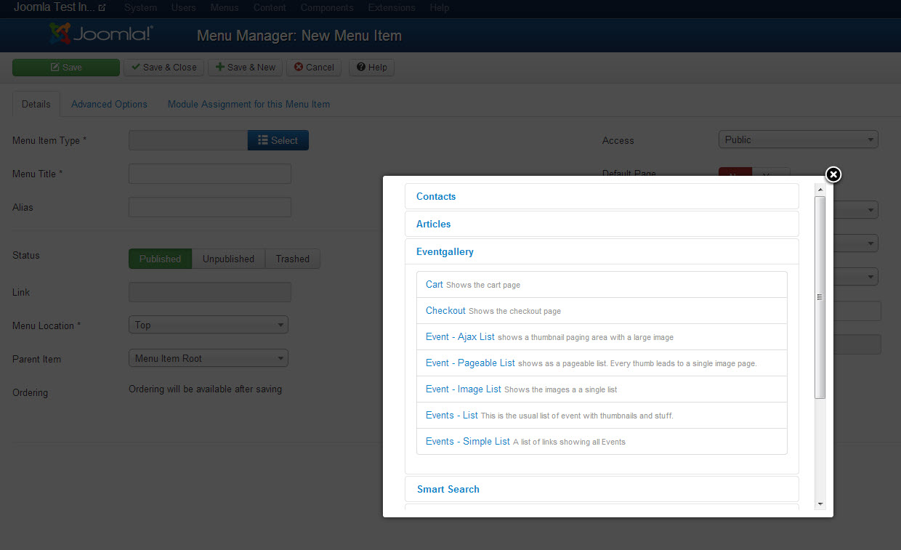
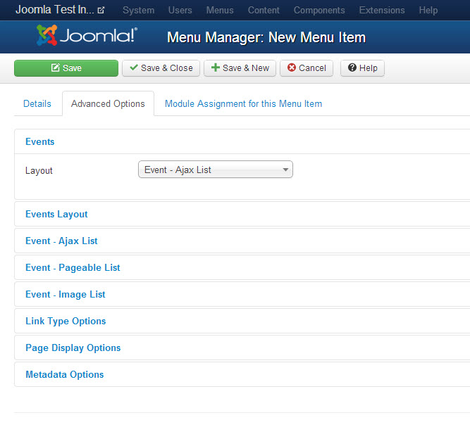
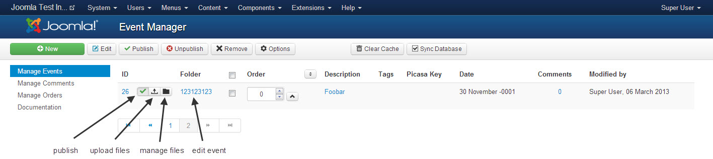
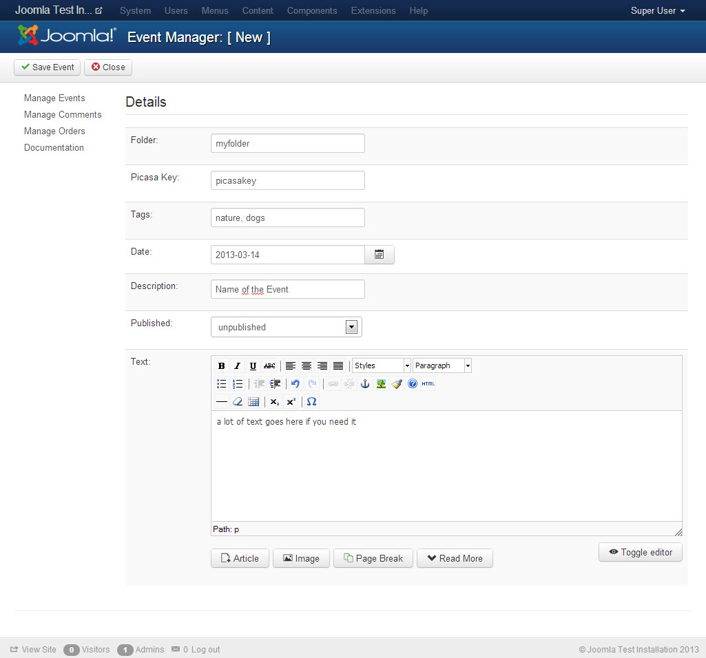
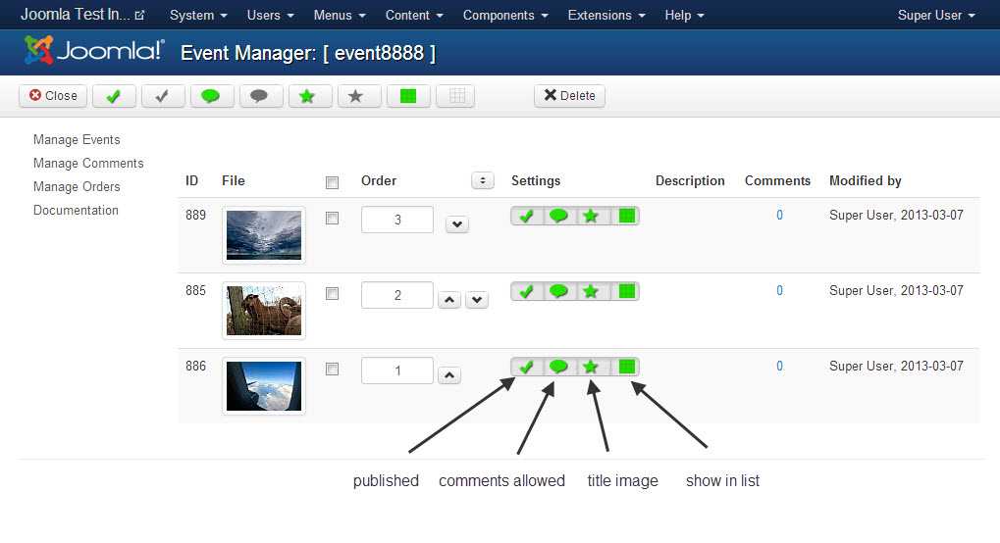
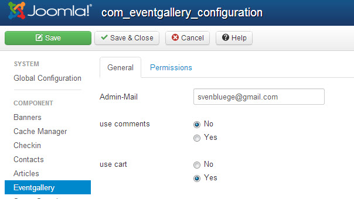
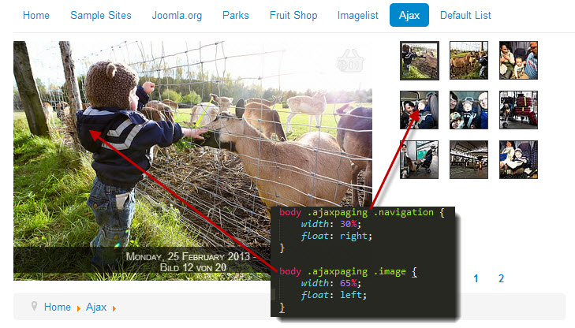

# Event Gallery Intro {#Intro}

It's time to introduce a new gallery component for Joomla. I guess you're already waiting for something like this since there is a real lack of such kind of components ;-)
Initially I build this component to show photos of different events to the audience. To where other components have folders this component calls them events. Because of this this component is called Event Gallery. 

If you want to support the development of this component you might want to have a look at this PayPal donation page or at Flattr.

Let's list all the features this gallery component provides:

- works with Joomla 3.0 and Joomla 2.5
- displays images from local folders and **Google Picasa**
- **cart & checkout** to allow the user to create a collection of images and request them from the photographer
- three different views for an image list
	- Image List

		This list type presents all images of an event as a simple long list. You can zoom into images using a lightbox.

	- Page able Image List

		While nearly identical to the Image List view this view provides a paging bar. Instead of opening each photo in a lightbox there is a dedicated page for every image. This page allows you to browser within the current event.

	- Ajax Image List

		If there is limited space the Ajax Image List is for you. It provides a split interface where you have a large image on one side and a pageable list of thumbs on the other side. 
- lightbox with integrated paging and support for *swipe gestures* on mobile

- comments - a user can comment a photo
- **deep links** - you can link from a menu directly to a specific event
- **tags** - you can assign tags to an event and use them to show events with specific tags in your event list only. 
- **responsive support** - the size of a image list changes, it'll recalculate the image layout to fit into the new page width
- Browser Support: partly IE7+IE8, IE9, Chrome & Firefox latest versions

# Requirements {#Requirements}

- Images! Large Images. At least as wide as the space where you want to show them is. Bigger is better :)
- Joomla 2.5 (>2.5.8) or Joomla 3
- PHP 5.3 or later
- GD library for PHP
- set the PHP memory limit high enough
- your Joomla Template should put jQuery into no conflict mode
- standard Joomla Mootools have to be available.
- your template should not produce any JavaScript errors before you install the component

# Videos {#Videos} 

The following videos will give you a quick introduction of how to set up this component.

Install

<iframe width="420" height="315" src="http://www.youtube.com/embed/f57CA0g08BI?rel=0" frameborder="0" allowfullscreen></iframe>

Create Events

<iframe width="420" height="315" src="http://www.youtube.com/embed/Dcs_baW5x_0?rel=0" frameborder="0" allowfullscreen></iframe>

Create Menu Items

<iframe width="420" height="315" src="http://www.youtube.com/embed/LaoPdMg5pgc?rel=0" frameborder="0" allowfullscreen></iframe>

# Link to the component {#LinkIt}

Creating links to the component is simple. Open the menu manager, create a new menu item and select the right view. The name of the component you want to link to is _Eventgallery_ so choose the right section and the available targets will appear. 

There are several views available:

- Cart

	Shows a page which contains the cart of the current user
	
- Checkout

	Displays the checkout page where the user can request his cart.

- Event - Ajax List

	Shows a specific event with the Ajax List view

	Basic Options
	- _Event_: the event you want to display

	Advanced Options
	- _show exif_ If EXIF information for an image are available this toggle switches them on or off. 
	- _show date_ You can toggle the appearance of the date for the events show within this menu item	
	- _Height of the thumbnails_ Defines the height of the thumbnails in the navigation bar.
	- _Number of thumbs per page_ defines how many thumbs you want to see on a page
	- _Number of thumbs on first page_ defines how many thumbs you want to see on the first page. Since there might be some additional text this number can be smaller than on other pages.

- Event - Pageable List

	Shows a specific event with the Pageable List view

	Basic Options
	- _Event_: the event you want to display

	Advanced Options
	- _show exif_ If EXIF information for an image are available this toggle switches them on or off. 
	- _show date_ You can toggle the appearance of the date for the events show within this menu item
	- _show hits_ I you use local images each visit of a single image page will be counted as a hit. This toggle switches the visibility of the current hit counter on or off.
	- _Height of the thumbnails_ defines the initial height of each row in the grid in pixel.
	- _Height jitter_ defines the maximum amount of pixel the row height can vary.
	- _Height of the first thumbnails_ defines the height in rows of the first photo in the list.

- Event - Image List

	Shows a specific event with the Image List view

	Basic Options
	- _Event_: the event you want to display

	Advanced Options
	- _show exif_ If EXIF information for an image are available this toggle switches them on or off. 
	- _show date_ You can toggle the appearance of the date for the events show within this menu item
	- _Height of the thumbnails_ defines the initial height of each row in the grid in pixel.
	- _Height jitter_ defines the maximum amount of pixel the row height can vary.
	- _Height of the first thumbnails_ defines the height in rows of the first photo in the list.

- Events - List

	Displays a list of events. 
	
	Basic Options
	- none

	Advanced Options
	- _Layout_ defines which layout to use for an event. You can configure the appearance of the event page with the options described above.
	- _Sort By_ defines the direction and the attribute which is used the sort the events.
	- _Intro Text_ defines a text for the events page. Usually displayed on top of the page. 
	- _Tags_ defines which tag a event need to get displayed on this list of events.
	- _Max events per Page_ How many events should we show per page until the paging bar will appear. 
	- _show exif_ If EXIF information for an image are available this toggle switches them on or off. 
	- _show event text_ Defines to show the text for an event on the event list. 
	- _show date_ You can toggle the appearance of the date for the events show within this menu item
	- _show hits_ I you use local images each visit of a single image page will be counted as a hit. This toggle switches the visibility of the current hit counter on or off.
	- _show image count_ Defines to display the overall number if images for an event on the events list
	- _show comment count_ Defines to display the overall number if comments for an image on the events list
	- _use full screen lightbox_ The normal lightbox would show up depending on the size of the image with a little border around. A full screen lightbox turn the screen completely black and shows the images.

	
- Events - Simple List

	Displays a list of links to events
	
	- see _Events - List_ for configuration options.

This gallery component supports just a flat list of folders. If you need a navigation tree you're out of luck. But you can achieve a tree structure using tags and Joomla menu items. Create a menu structure which represents the structure you would like to have. Each menu item might link to the view of the event gallery you need. This is simple if you link directly to an event. If you want to have different list you can use tags to separate the lists. 

Example for such a structure: 

- Event1 -> Tags = nature
- Event2 -> Tags = nature
- Event3 -> Tags = architecture
- Event4 -> Tags = people, men
- Event4 -> Tags = people, men
- Event4 -> Tags = people, women
- Event4 -> Tags = people, children

You can arrange the events within the following menu structure:

- Menu Item 1 -> Event List with tag "nature"
- Menu Item 2 -> Event List with tag "architecture"
- Menu Item 3 -> Event List with tag "people"
	- Menu Item 4 -> Event List with tag "men"
	- Menu Item 5 -> Event List with tag "women"
	- Menu Item 6 -> Event List with tag "children"

# Manage Events {#Manage}

The first page you see is the events page. You can manage your events here. Aside of creating a new event you can set an event offline/online, upload files, open the file list and open the edit view. In addition there are two more buttons in the toolbar:

- Sync Database
	
	You can do the upload using FTP or the build in image uploader. Since this component uses the databases to store information about files it needs to be updated once you change something directly at file system level. You can add/remove files and folders. By hitting the sync button added folders and files get added to the database while removed files/folder get removed. Finally the database is in sync with the file system. If you try to upload using FTP put your images into a new folder below  _/images/eventgallery/_

- Clear Cache

	The component caches all calculated images. If you feel you have to clear this cache just hit this button. Keep in mind that refreshing the cache might be expensive. 

## Edit Event {#EditEvent}

The view let's you edit the details of an event. 

- Folder

	Specifies the folders name. If you want to add a Google Picasa album, use this syntax user@albumid. Avoid special characters in the folder name. Any name containing an @ will be interpreted as a Picasa album. 
	
- Picasa Key

	If you want to include a Picasa album which is not public but accessible using a special Picasa key, then add this key here. In case you pulled the URL from Google Plus prefix it with `Gv1sRg`. Otherwise the album will not appear. 

- Password

	Set a password for each folder if you want to protect it somehow. If a user tries to access such a folder he need to enter a password. If you want to send out links to a password protected folder you can add this password directly to the link and nobody needs to be bothered by a password page. 

- Tags

	A comma separated list of tags you want the event to have.

- Date

	This date is shown in the front end for this event.

- Description

	This description is shown in the front end as the events name.

- Published

	Is this event visible in the front end?

- Cartable
	
	Defines if users can add images from this folder to the cart. Useful if you want to display image where it makes no sense for getting requests for.

- Text

	You can add additional text to an event. This text is usually shown above the thumbnails in the front end.

## Manage Files {#ManageFiles}

Once you created your event and uploaded some photos you may want to manage those files. Here is the right place for it. On this page you can sort, delete and modify the status of an image. If you want to change the title or the description of an image just click on "Title" or "Description" and enter your data to the two fields which appear. Hit the save button to store it in the database.

- published

	Defines if this image appears in the front end.

- comments allowed

	Defines if comments are allowed for this image.

- main image

	Should this image be used for the overview page in the front end? Multiple selections are possible, the image with the highest ranking will win.

- show in image list
	Sometimes you want show an image on the overview page but not in the actual image list. With this option you can hide the image on the list. It'll only appear on the overview page if it is defined as a main image.

The status of an photo can be changed by the button in the status column. By using the check boxes and the buttons in the toolbar you can perform an operation for multiple photos.

## Manage Comments {#ManageComments}

Once somebody added a comment to an image this comment will appear here. You can filter the comments by several attributes, edit and remove them. 

# Configuration options {#configuration}

There are only a few things globally manageable. 

- Admin-Mail

	This address is used to send notification about comment and image request to. Don't forget to and an address here if you activate at least one of the options below. Otherwise your users will see errors while posing comments and requesting images. 

- use comments

	Defines if comments are enabled. 

- use cart

	Defines if the cart functionality is visible in the front end.

- show external cart link

	Defines if we show a link for each image which can direct the user to a product detail page. This will cause conflicts with the internal cart buttons so you should disable to internal cart feature or do some css magic to align both buttons in the right way.

- show social sharing button

	You can enable your visitors to post links to images in social media. In addition you can enable different sharing options with the dedicated buttons for each service. They should work out of the box, only the Facebook button needs additional configuration.

- Facebook App Id

	Specify a App Id for your Facebook application which is responsible for sharing the links to your images. Make sure the App is configured to work with your domain. The app need to have the permission photo_upload. 

- external cart link

	Defines a pattern for an external link. You can use the following placeholder: ${folder},${file} and ${fileBase} like this: http://www.foo.bar?category=${folder}&amp;sku=${fileBase}

- external cart link rel
	
	Defines the rel attribute of this link. By default this is nofollow so the search engine crawlers will not follow your external cart links.

- image quality

	Defines the output quality of every generated image. Default is 85% which is pretty good. Lower values will result in lower quality.

- use sharpening

	Enables or disables the sharping functionality. If image sharping is enabled it uses the matrix defined below.

- Sharpen Matrix

	You can define a matrix which is used to sharpen the generated images. By default this is [[-1,-1,-1],[-1,16,-1],[-1,-1,-1]] and it will do a good job. In case you want to have blurry or even sharper images this is the configuration parameter you'll have to touch. Please find the possible values here: http://php.net/manual/en/function.imageconvolution.php . In case you have no clue what this is about, don't touch it. After a change delete the cache otherwise you will see no result.

- Use Rendering Fallback

	On some servers the execution of script is not allowed in subfolders. The execution is necessary since images are delivered by a script and we don't want to run the whole joomla framework for every request. If you encounter issues with images that do not appear, you can use the fallback to use index.php for image delivering. This is `slow and should be not your long term solution`. Contact your provider to make sure php scripts can be executed in component folders. At least this would be great for the following scripts: components/com_eventgallery/helpers/image.php and blank.php.

# Extend {#Extend}

This section is intended to provide some help with customizations. Keep in mind that you should never touch files of the component directly. Use the overload techniques provided by Joomla to achieve your goal. For example put your changed CSS definitions into your templates CSS files. If you want to overload a view templates, put it into your templates html folder. 

### Modify Ajax List

If you want to display the thumbnails beside the big image you can simply let them float the way you need them. 

### Modify Events List

The number of elements per row is something you can change by simple CSS. There is not configuration option because with css you can use Media Queries to adjust the tiles based on the current view port.

A simple css definition would look like this. It will give you 4 item per row.

	div#events .item-container {
		width: 25%
	}
	
You can even use media queries to adapt the number of tiles per row based on the current view port. 

	div#events .item-container {
		width: 33.3333333333%;
	}

	@media (max-width: 900px) {
		div#events .item-container {
			width: 50%;		
		}
	}

	@media (max-width: 450px) {
		div#events .item-container {
			width: 100%;		
		}
	}

### Language Files

First of all install the necessary languages using the Language Manager of Joomla. This is independent from this component and a requirement for the next steps. To translate the gallery into your language you have several options. Let's assume you want to have the gallery translated to Spanish with the locale es-ES. The following options are available

- create/reuse the file `language/overrides/es-ES.override.ini` and put your translations into this file. You can change the content of this file using Joomlas language management in the back end.
- create a file `language\overrides\language\es-ES\es-ES.com_eventgallery.ini` and add your translations in there. (available since 2.6.4) 

With each new version it might be necessary to add new translation keys to your custom file. If you choose option 1 this would be possible without touching any file in the file system manually. You can use the Joomla back end to add the missing keys. Starting with 2.6.4 each installation or update will delete translation files from /language/xx_YY/. If you added your changes there make sure you migrate them to one of the options mentioned above. 

# FAQ {#FAQ}

## Thumbs do not show up {#FAQThumbs}

### Server
- `mod_secure`: Please `ask your provider` about possible issues with that. Doing this solved 99% of the issue.
- Error 500: PHP memory size too low. I have good experience with 128M. Depends on the size of your images
- do not use special characters in your file names like Umlaute, +, or things like this. Make your file names safe for the web.
- Error 500: the PHP function imageconvolution does not work on your server. For now one user reported this using PHP 5.3.8. After commenting out the line of code the gallery worked fine.
- you use space character in your folder name (fixed since 2.6.2)
- install GD library for image processing
- issues with image sharping. Try to disable it using the components configuration dialog.
- PHP should have write permission to /images, /cache and /logs
- Picasa Images do not show up because the method get\_file\_content is not working. Check with your hosting provider to solve this issue.
- Error 500: PHP should be able to execute the script /components/com_eventgallery/helpers/image.php in order to display thumbs.
- try to use Use Rendering Fallback and contact your provider if this works for you so he can change the server settings.

### Joomla Configuration
- Picasa albums do not work because your SEO-component strips out the @-sign from the URLs

### Browser
- JavaScript error occurred which prevents the whole site from executing JavaScript. Without JavaScript it no image will appear.
- To verify that there are no JavaScript errors on your page do this:
	- open the site in your browser
	- Chrome: press F12 to open the developer tools
	- switch to the Console tab
	- check if there are read warnings
	- if the console window is empty you're fine
- MooTools JavaScript library is not available
- your template loads old libraries like MooTools 1.2.5
- you have a fancy plugin installed which does not care about Joomla an pulls in jQuery without calling jQuery.noConlict() afterwards [jQuery noConlict Documentation](http://api.jquery.com/jQuery.noConflict/)
- conflict between original LazyLoad and the custom one which is shipped with event gallery (fixed with 2.6.3)
- conflict between original advanced MediaBox and the custom one (fixed with 2.6.4)

## Lightbox does not work {#moreFAQ}

- instead of opening an image in a lightbox it opens in a new windows: check for JavaScript errors on your page. Maybe you Joomla Template filters out MooTools, does not load jQuery in no conflict mode or is doing even worse stuff. 

## Images are not properly aligned

- the CSS of your Joomla Template might influence the images 
- your images are too small to spread to the necessary width

## Folders get lost with the sync job

- make sure your files&folder do not contain a dot in the name. This is not supported. Even if I would, this would cause issue with enabled URL rewriting.
- folder should contain at least one file

## Image-Upload does not work

- 100% of the time the upload is refused by the server because of restrictive security configurations. Please contact your provider. They can fix it. In the meantime you can use FTP to upload the images to `/images/eventgallery/[your folder]` and hit the "Sync Database" button in the main tool bar of the Event Gallery component in the back end.

# Event Gallery Release Notes {#ReleaseNotes}

	Author: Sven Bluege
	Mail: svenbluege(at)gmail.com
	Web: http://www.svenbluege.de

## 2.6.8
	- New Features
		- the Facebook Feed Dialog is gone. Did not work very well. Now the images are 
		  shared directly to the users Facebook album. Just make sure that you Facebook 
		  App has the photo_upload permission to get it working.
		- support for menu item based keyword/robot configuration
    - Bug Fixes
    	- removed some strict warnings while rendering images
    	- removed some strict warnings while in the events list
    	- avoid fail to render an image because of invalid EXIF data
    	- fixes square sized image defect when images are coming from picasa web
    	- fixes issue in case url rewriting with a suffix is enabled. In this case the cart does not work.

## 2.6.7

	- New Features
		- Social Media Sharing Buttons. The links which can be shared for an image direct 
		  the user to a mini page which presents the image. With a click on this image 
		  the user gets redirected to the event. Facebook need to read the original image
		  so don't put any restrictions on the image folder if you want to use the sharing
		  options.
		- EXIF support for local images. Just sync your database to read the information 
		  from the files to the database. Once you did this, EXIF information will show up
		  for each image.
		- Thumbs contain now the original EXI information. This will help to have the 
		  necessary meta data available once those images appear somewhere else.

	- Bug Fixes
		- fixed usage of wrong configuration set once the current menu item is not given

## 2.6.6
	- Bug Fixes
		- Fixed an issue with the folder selection form field which throw an 
		  exception like "Class 'JFormFieldList' not found".

## 2.6.5
	- Bug Fixes
		- the second row of images on an events list just loaded after you scroll on the 
		  page. This is fixed now.

## 2.6.4

	- New Features
		- added option to display links to external sites instead of using the internal
		  add2cart button. As of now there is a global configuration option where you 
		  can define a pattern for the external link. Make sure you use the internal 
		  or the external cart button only. If you're fit with JavaScript you can 
		  target the new add2cart button and apply a different behavior. The link 
		  contains two attributes data-file and data-folder which might become useful.
		- Lightbox uses it's own name space now. This will reduce the conflicts with 
		  other lightbox includes.
		- List of events supports paging now
		- remove the a lot of configuration options for the events list (the new 
		  feature is the clean code ;-)
		- language lookup extended to 
		  language\overrides\language\xx-YY\xx-YY.com_eventgallery.ini so you can 
		  manage your localized files independent from the component. 

	- Bug Fixes
		- fixed missing error messages on checkout page
		- updated markdown library to prevent some warning messages in the documentation 
		   view
		- fixes issue with flexible layouts. The width is calculated initially, then 
		  the scroll bars appear and the width decreases. The images will end up unaligned. 
		  Now I set the min-width of the container initially to a height so the 
		  scrollbars appear and the width calculation works.

## 2.6.3

	- New Features
		- improved caching. Files don't get purged if you purge the expired Joomla cache.
		- removes possible conflict with original LazyLoad version.
		- events list uses lazyload and dynamic image resizing like on the image list.
		- AJAX list loads images based one the available page size.
		- react on missing write permission on cache folder while writing a thumbnail
		- configuration option for image quality added.
		- significant reduced memory consumption and increased performance for processing 
		  Google Picasa XML files.
		- added limit box for events list and file list
		- you can define the sorting of events for every menu item.
		- improved order mail
		- added option to display the lightbox in full screen mode. This is very handy if 
		  you want to support mobile devices since this mode does not waste as much space 
		  as the current lightbox.
		- workaround for image delivery problems on some servers. See Use Rendering 
		  Fallback in the components global configuration options for details.

	- Bug fixes
		- the large image in ajax mode was not correct aligned. Usually it was displayed 
		  too large.
		- better support for SEO components like aceSEF.
		- Fix for showing tiny thumbs in Opera using a template which does not define the 
		  border-width for the css class .thumbnail
		- removed Strict Standard messages
		- PHP 5.2 seems to work now.

## 2.6.2

	- New Features
		- Ajax list: thumb size is configurable
		- configuration to show/hide EXIF information in descriptions
		- you can target (and therefore hide) each button of the navigation bar on the 
		  single image page using CSS
		- added CSS classes to access date, text to style date, description and text of 
		  an event individually.
		- added toggle for date, image hits, image count, comment count for each menu item
		- added compatibility for IE7 and IE8. You should at least see something now. 
		  Create your own browser specific css 
		  (http://www.webmonkey.com/2010/02/browser-specific_css_hacks/) to make it look 
		  nice with your Joomla Template. Keep in mind that I'll not start testing with IE7 
		  and IE8 but I'll react on the defects you submit. No "not pixel perfect" bugs for 
		  those browsers please. 
		- restricted possible thumb sizes to one of those entries {32, 48, 64, 72, 94, 104, 
		  110, 128, 144, 150, 160, 200, 220, 288, 320, 400, 512, 576, 640, 720, 800, 912, 
		  1024, 1152, 1280, 1440}. Each size is available as a square sized version and 
		  normal sized scaled down version. Doing this will prevent attackers from creating 
		  unlimited thumbs and exceed your web space.
		- Configuration option for the image sharpening
		- Embed ICC profiles. Very useful for all the people with wide gamut displays which 
		  don't like cartoon colors. 
		- instead of setting the width & height for an image we use the right sized 
		  transparent gif now. This will make !important statements in css file unnecessary. 		
		- added support for page heading configuration at a menu item

	- Bug fixes
		- tag support: menu item for the event list can define a comma or space separated 
		  list of tags
		- fixed issue with the loading image on very small screens on the single image page
		- fixed encoding issues for event text, file title and file description 
		- fixed enlargement of images which are uploaded smaller than 1440px in the lightbox 
		  and image lists.
		- cleaning the cache is working again. Wrong task was referenced so nothing happened.
		- an event gallery page can now be the default page

## 2.6.1

	- New Features
		- added management for titles and captions for each file
		- lightbox is now capable to handle text which contains not just three words
		- documentation update

	- Bug fixes
		- fixed German language in Ajax list (Bild 1 von 10)
		- fixed HTTP 500 caused by large log file containing for Picasa access requests. 
		- fixed SEO URLs when appending a suffix like .html to every URL.
		- fixed adding comments. 
		- fixed enlargement of images because of JavaScript calculations
		- fixed hiding of navigation buttons in single image view if the last / first image 
		  is shown.
		- fixed blue background in Ajax view with J2.5 default template
		- fixed issue with lightbox and some URL encoding. Lightbox opened but no image 
		  appeared. 

## 2.6.0

	Initial public release